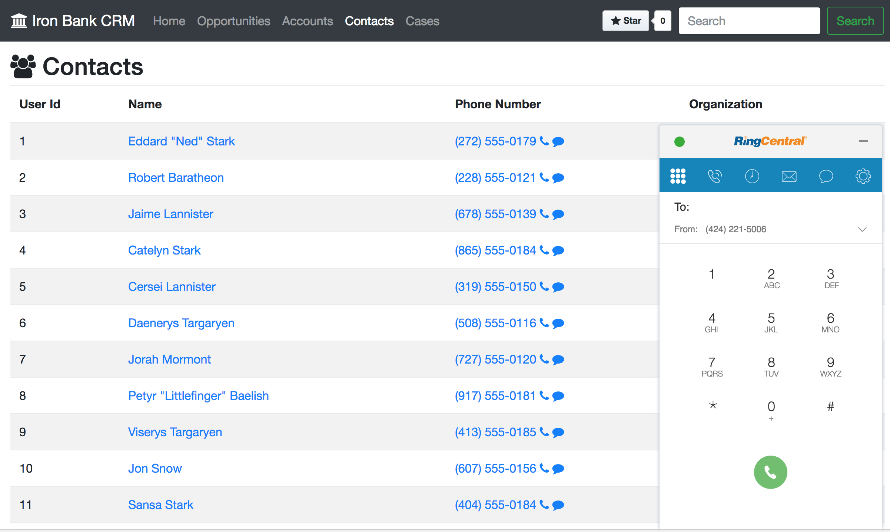

# RingCentral Web Widget + Salesforce Open CTI Tutorial

[![Docs][docs-readthedocs-svg]][docs-readthedocs-url]

This is a set of demos to get started using the RingCentral Web Widget:

* Embeddable Web Widget: https://github.com/ringcentral/ringcentral-web-widget
* React Component Library: https://github.com/ringcentral/ringcentral-js-widget

## Demos

| Demo | Description | Click-to-Dial | Click-to-Text | Screen-Pop | Call Log | Live Demo |
|------|-------------|---------------|---------------|------------|----------|-----------|
| [Static Simple](https://ringcentral.github.io/ringcentral-web-widget/) (external) | `tel` and `sms` URI schemes | y | y | n | n | [Live Demo](https://ringcentral.github.io/ringcentral-web-widget/) |
| [Static CRM](http://ringcentral-web-widget-demos.readthedocs.io/en/latest/static_crm/tutorial/) | Static CRM example | y | y | y | n | [Live Demo](https://ringcentral-tutorials.github.io/ringcentral-web-widget-demos/static_crm/code) |
| [Salesforce Lightning](http://ringcentral-web-widget-demos.readthedocs.io/en/latest/salesforce_lightning/tutorial/) | Core use cases | y | n | y | y | [Video](https://www.youtube.com/watch?v=uXZkYNVaGc0) |
| [Salesforce Plus](http://ringcentral-web-widget-demos.readthedocs.io/en/latest/salesforce_lightning_more/tutorial/) | Additional screen pops for Google/LinkedIn Search | y | n | y | y | |
| [Java desktop app using jxBrowser](https://github.com/tylerlong/jxbrowser-webrtc) (external) | Embedding Chromium in a Java app. | y | n | y | n | [Video](https://www.youtube.com/watch?v=SKpLd20b2OM) |

### Static CRM Demo

This is a quick demo showing a CRM with Click-to-Dial, Click-to-Text and Inbound Screen-Pop.

 [docs-readthedocs-svg]: https://img.shields.io/badge/docs-readthedocs-blue.svg
 [docs-readthedocs-url]: http://ringcentral-web-widget-demos.readthedocs.org/